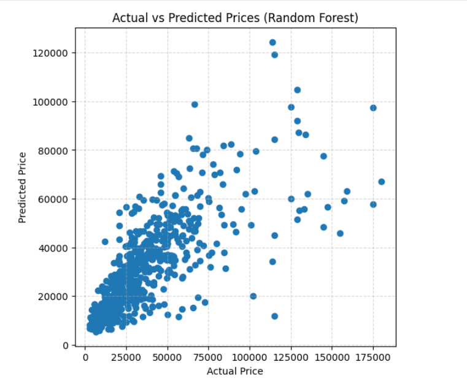
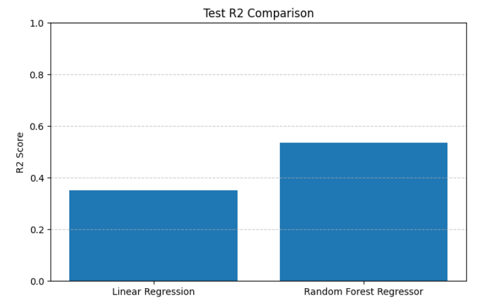

🚗 Used Cars Price Prediction

A Machine Learning project to predict used car prices using real-world data and regression models.

📌 Project Overview

This project builds a regression model to estimate used car prices based on features like brand, model, fuel type, and more.

🔍 What I did

- Cleaned and prepared real-world data
- Handled missing values and outliers
- Built a preprocessing pipeline:
  - SimpleImputer
  - StandardScaler
  - OneHotEncoder
- Trained and compared models:
  - Linear Regression
  - Random Forest Regressor

📊 Results

- Random Forest outperformed Linear Regression
- Better RMSE and R² scores
- Improved generalization on test data

## 📊 Sample Output

### 📈 Actual vs Predicted

### 📉 RMSE Comparison

### 📊 R² Comparison

🛠️ Tech Stack

- Python
- Pandas
- NumPy
- Scikit-learn
- Matplotlib

🚀 Next Step

Deploying the model using Streamlit

🔗 Colab Notebook
https://colab.research.google.com/drive/1N3jzpnBMepjjUowJwp8BLY1xosOlN2n2#scrollTo=LaSY-lMU6Ndq

Add README
